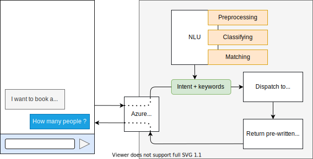

# Resa Chatbot

A cross-platform chatbot based on MS Bot Framework, PyTorch and a fine-tuned BERT model, to demonstrate how to easily create complex dialogs and deploy it on Azure.

Test is on [chatbot.joffreybvn.be](https://chatbot.joffreybvn.be), **tell him that you want to book a hotel room**!

### Project timeline

    

This project was completed in 5 days by two Machine Learning students from BeCode:
 - **Vincent Leurs**: [Twitter](https://twitter.com/VincentLeurs) - [Github](https://github.com/paradous)
 - **Joffrey Bienvenu**: [Website](https://joffreybvn.be/) - [Twitter](https://twitter.com/Joffreybvn) - [Github](https://github.com/joffreybvn)

### Bot features
- Advanced NLU (thanks to BERT) to understand custom intentions
- Strong entity and keywords matcher, to detect complex informations  
- Flexible dialogs flow that adapt to user's responses
- Easy-to-interact on any platform, thanks to cards, button and more

### The dialog flow

    

The process of transforming and sanitizing a message in order to be able to classify it.
The process of recognising and giving a label to a message.
### Techs and libraries used

The efficient implementation of our solution relies on a plethora of solid libraries:

| Library | Used in |  Detail |
|---|---|---|
| BeautifulSoup | [Preprocessor.py](/src/nlu/preprocessing/preprocessor.py) | Preventing and removing tags and other HTML elements |
| Unidecode | [Preprocessor.py](/src/nlu/preprocessing/preprocessor.py) | Removing all accents  |
| SpaCy | [Preprocessor.py](/src/nlu/preprocessing/preprocessor.py) | Lemmatize and detect numbers written in letters  |
| word2number | [Preprocessor.py](/src/nlu/preprocessing/preprocessor.py) | Replace the numbers written in letters, into digits |
| contractions | [Preprocessor.py](/src/nlu/preprocessing/preprocessor.py) | Detecting and replacing contracted forms of language |
|  |  |  |
| transformers | [Classifier.py](/src/nlu/classifying/classifier.py) | Downloading and using BERT |
| PyTorch | [Classifier.py](/src/nlu/classifying/classifier.py) | Fine-tuning the model based on our dataset  |
| PolyFuzz | [Classifier.py](/src/nlu/classifying/classifier.py) | With regex, to detect keywords and complex intentions  |

### This bot is cross-platform

All these libraries have been brought together with Microsoft's Bot Framework, a tool that allows us to publish this bot on all the following platforms:

    

