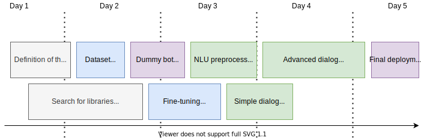

# Resa Chatbot

A cross-platform chatbot based on MS Bot Framework and a fine-tuned BERT model, to demonstrate how to easily create complex dialogs and deploy it on Azure. Test is on [chatbot.joffreybvn.be](https://chatbot.joffreybvn.be) !

### Project timeline

    

This project was completed in 5 days by two Machine Learning students from BeCode:
 - **Vincent Leurs**: [Twitter](https://twitter.com/VincentLeurs) - [Github](https://github.com/paradous)
 - **Joffrey Bienvenu**: [Website](https://joffreybvn.be/) - [Twitter](https://twitter.com/Joffreybvn) - [Github](https://github.com/joffreybvn)

### Techs and libraries used

The efficient implementation of our solution relies on a plethora of solid libraries:

#### Inputs preprocessing

| Library | Used for |
|---|---|
| BeautifulSoup | Preventing and removing tags and other HTML elements |
| Unidecode | Removing all accents  |
| SpaCy | Lemmatize and detect numbers written in letters  |
| word2number | Replace the numbers written in letters, into digits |
| contractions | Detecting and replacing contracted forms of language |

The pre-processing is done in the [Preprocessor.py](/src/nlu/preprocessing/preprocessor.py) object.

## Cross-plateforme implementation

## fonctionnalités du Bot :

### Traitement des inputs "utilisateurs"

- Bert ?

### Possible réponses

- Accueillire
  - Décrire les fonctionnalités du bot
  - Répondre 
- Donner les heures d'ouvertures
- Afficher une liste d'objet, de produit 

### Nice to have

- Réserver un service / un produit 
  - Gérer un agenda
  - vérifier la disponibilité
  - 
- 

    "**In English**, the bot should be able to :\n",
    "\n",
    "- Understand phrases related to a room reservation.\n",
    "Example that the bot will have to understand: \n",
    "\n",
    "\t\t> I wish to reserve a room for 2 people.\n",
    "\t\t> I wish to reserve a room for 4 days\n",
    "\t\t> Do you have rooms available from July 23rd?\n",
    "\t\t> I would like to reserve a room for two days and for two people\n",
    "\n",
    "- Understand phrases related to a table reservation for the restaurant. \n",
    "\n",
    "\t\t> I would like to make a reservation for tonight.\n",
    "\t\t> I'd like to reserve a table for four people.\n",
    "\n",
    "- Must ensure a continuous and ongoing conversation. Example of a complete conversation : \n",
    "\n",
    "\t\t> Customer : Hello !\n",
    "\t\t> Bot : Hello, how can I help you? \n",
    "\t\t> Customer: I would like to reserve a table for 4 people ? \n",
    "\t\t> Bot : For which date would you like to reserve your table?\n",
    "\t\t> Customer : Today at 7:00 pm\n",
    "\t\t> Bot : What name should I make the reservation under?\n",
    "\t\t> Customer  : My name is Mr. Dupont! \n",
    "\t\t> Bot : Very well Mr Dupont, I confirm you the reservation of a table for 4 people tonight at 7:00 pm. \n",
    "\t\t> Bot : Can I help you with something else?\n",
    "\t\t> Customer : No thanks\n",
    "\t\t> Bot: Have a nice day. \n",
    "\n",
    "- Understand when the client is angry. In this case, the bot will indicate that it is transmitting the conversation to a human. \n",
    "\n",
    "\t\t> You're incompetent!\n",
    "\t\t> My room is dirty! This is outrageous!\n",
    "\t\t> I want to talk to a human. \n",
    "\n",
    "### Nice-to-have features\n",
    "- Create an API of your bot to make it cross-platform \n",
    "- Use Docker\n",

## Hébergement du Bot

Timeline:
- Etablir l'objectif (déployer bot cross-plateforme + créer propre modele)
- Trouver un framework >> MSBotFramework
- Créer un dataset 
- Deployer dummy bot